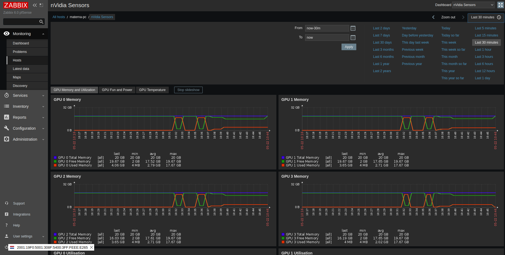
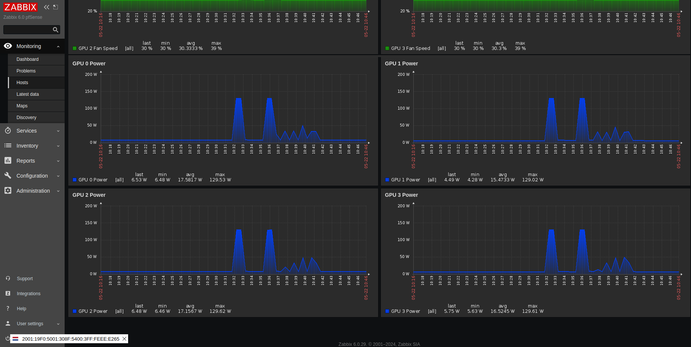
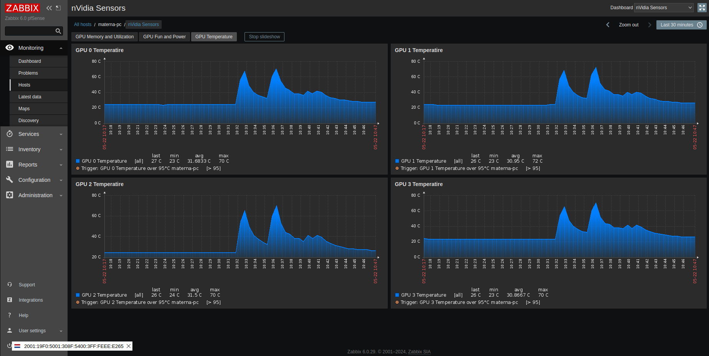
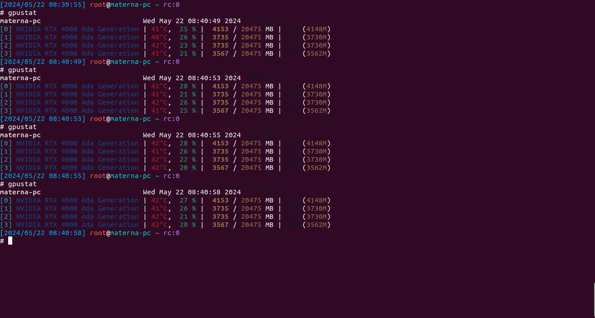

# zabbix-nvidia-smi-integration

This repository has a Zabbix template for monitoring nVidia graphics cards in particular the:

* GPU Utilization
* GPU Power Consumption
* GPU Memory (Used, Free, Total)
* GPU Temperature
* GPU Fan Speed

The information on how to configure the Zabbix agent is below. The template should be added to the server and
nVidia-SMI should be installed on the node that is to be monitored.

The following parameters need adding to the configuration directory for the agent /etc/zabbix/zabbix_agent2.d/nvidia.conf

```console
UserParameter=gpu.discovery,/usr/local/bin/gpu-count.sh
UserParameter=gpu.temp[*],nvidia-smi --query-gpu=temperature.gpu --format=csv,noheader,nounits -i $1
UserParameter=gpu.memtotal[*],nvidia-smi --query-gpu=memory.total --format=csv,noheader,nounits -i $1
UserParameter=gpu.used[*],nvidia-smi --query-gpu=memory.used --format=csv,noheader,nounits -i $1
UserParameter=gpu.free[*],nvidia-smi --query-gpu=memory.free --format=csv,noheader,nounits -i $1
UserParameter=gpu.fanspeed[*],nvidia-smi --query-gpu=fan.speed --format=csv,noheader,nounits -i $1
UserParameter=gpu.utilisation[*],nvidia-smi --query-gpu=utilization.gpu --format=csv,noheader,nounits -i $1
UserParameter=gpu.power[*],nvidia-smi --query-gpu=power.draw --format=csv,noheader,nounits -i $1
```

The following code was developed from [this template](https://gist.github.com/bhcopeland/b54d3c678a0cb6e87119) and further refined to avoid the need to directly parse output from nvidia smi with grep and cut.

For GPU card discovery, a script is used that outputs information via nvidia-smi in JSON, which is processed by zabbix-server.

### Tested on Ubuntu 22.04.4

```console
# nvidia-smi --version
NVIDIA-SMI version  : 550.78
NVML version        : 550.78
DRIVER version      : 550.78
CUDA Version        : 12.4
```

### GPU test nVidia by tool [gpu-burn](http://wili.cc/blog/gpu-burn.html)  
```console
git clone https://github.com/wilicc/gpu-burn.git
cd gpu-burn
make
./gpu_burn 60

or

docker run --rm --gpus all gpu_burn
...
Tested 4 GPUs:
	GPU 0: OK
	GPU 1: OK
	GPU 2: OK
	GPU 3: OK
```

### AI test ollama

```console
# ollama run llama2:7b-chat-fp16
>>> How many people live in central Europe

Central Europe is a region that includes several countries, and the total population of these countries can vary depending on the 
definition of central Europe used. However, here are some approximate population figures for some of the countries commonly considered to 
be part of central Europe:

1. Austria: around 8.8 million people (2020 estimate)
2. Belgium: around 11.5 million people (2020 estimate)
3. Czech Republic: around 10.6 million people (2020 estimate)
4. Denmark: around 5.8 million people (2020 estimate)
5. Germany: around 83.2 million people (2020 estimate)
6. Hungary: around 9.8 million people (2020 estimate)
7. Luxembourg: around 0.6 million people (2020 estimate)
8. Netherlands: around 17.2 million people (2020 estimate)
9. Poland: around 38.5 million people (2020 estimate)
10. Slovakia: around 5.4 million people (2020 estimate)

Total population of central Europe: around 376.6 million people (based on the above estimates).

It's worth noting that these numbers are approximate and may vary depending on the source and methodology used to determine the population 
of each country. Additionally, there is no one definition of central Europe that is universally accepted, and different sources may define 
the region in slightly different ways.
```

### Images






### To do

- Ansible deployment
